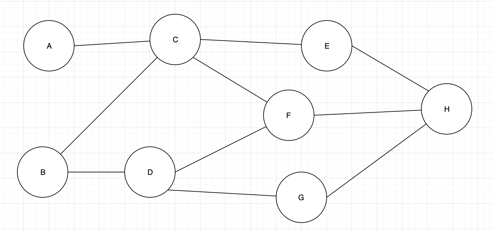

# 传输框架说明
系统中有三种类型的数据传输：
1. 邻节点推送，节点向自身的某个邻节点推送数据
2. P2P传输，节点向指定地址的节点传输数据
3. 全网广播


## 邻节点推送 
### 推/拉算法
考虑节点A、B和C，A向B和C发送某个数据块，经过一段时间的延时后，B转发此数据区给C，但此时C已经收到过A发送的数据了，因此这个数据再发送一次是没有意义的。

我们使用如下的方案，当A需要向B发送数据时，A首先向B发送到一个数据传输请求，这个请求里包含了待发送数据块的哈希值，B收到这个请求后，本地检测哈希对应的数据块是否存在，只有当这个数据块不存在时，才会向A请求此数据，因此包含四个步骤：
1.  A 向 B发送 {pushhash,hash}
2.  B 向 A请求 {pullhash,hash}
3.  A 向 B发送 {pushdata,hash,data}
4.  B 验证 Hash(data) == hash

通过这个方式，使数据不会重复传输


## 点到点传输算法

假设有如下的网络拓扑：


### 路由发现

#### 发现请求
1. 当B需要发送数据给H时，从邻节点中寻找$\alpha$个离H更近的节点，向这$\alpha$个中继节点发送数据数据中继请求$\{FIND,dest,\alpha,orgttl,ttl,[hash]\}$
2. 在图中，B找到了C/D,当C/D收到此中继请求时 ，将ttl值减去1，然后查找到下一级，在C中找到了E和F，在D中找到了F和G
3. E/F/G将TTL减去1，然后查找到下一级H
4. H收到E/F/G来的请求，发现是自身，通EFG向B发送回应
   
#### 发现回应
1. 发现回应过程中，节点只向上次向自己发送发现请求的节点传播数据
3. 由于节点都是不可信的，因此有可能中间的路由节点会造假，为了防止造假，节点回应的路由信息中，需要有路由目标地址的签名和中间所有中继的签名,在第一个版本中，为了简化开发，要求必须记录从上一节点到目标节点的所有签名，假设我们从B发送了到H的路由请求，然后从H返回此路由回应。
   1. H向E、F、G发送经过签名的路由回应`{createTime:xxx,path:[None],sign:sh}`此处的sh是h对createTime的bls签名；
   2. E/F中记录路由信息，E中
        ```
        {
            createTime:xxx,
            minttl:1,
            routes:[{next:H,path:None}],
            sign:se
         }
        ```
        和F中：
        ```
        {
            createTime:xxx,
            minttl:1,
            routes:[{next:H,path:None}],
            sign:sf
        }
        ```
        此处的se是e对createTime签名`se'+sh`,由于`bls`签名的线性，这个签名是可验证的。sf同理,此处把自己的签名直接生成加入，免得每次路由查询的时候需要重新生成
   3. E向C发送路由回应
        ```
        {
            createTime:xxx,
            route:[{next:H,path:None}],
            sign:se
        }
        ```
   4. F向C发送路由回应
    ```
        {
            createTime:xxx,
            route:[{next:H,path:None}],
            sign:sf
        }
    ````  
   5. C收到两条路由回应后，形成一条具有两条路径到H的记录,此处的sc同样是bls签名,可以通过E+F+H+C的公钥进行验证
    ```
    {
        createTime:xxx,
        minttl:2,
        route:[
            {next:E,path:[next:H,path:[None]],sign:se},
            {next:F,path:[next:H,path:[None]],sign:sf}
            ],
        sign:sc
    }
    ```
   6. C向B回应路由消息
    ```json
    {
        createTime:xxx,
        next:[
            {next:E,path:[{next:H,path:[None]}]},
            {next:F,path:[{next:H,path:[None]}]}
            ],
            sign:sc
    }
    ```
   7. D同样向B回应路由信息
   ```dotnetcli
    {
        createTime:xxx,
        next:[
            {next:H,path:[None]},
            {next:F,path:[{next:H,path:[None]}]}
            ],
            sign:sc
    }
   ```
   8. B中形成路由信息
    ```dotnetcli
      {
        createTime:xxx,
        minttl:2,
        route:[
           {
            next:C,
            minttl:3,
            path: [
                {next:E,path:[{next:H,path:[None]}]},
                {next:F,path:[{next:H,path:[None]}]}
             ]
            },
            {
             next:D,
             minttl:2,
             path: [
                {next:H,path:[None]},
                 {next:F,path:[{next:H,path:[None]}]}
            ]}
        ],
        sign:sb
      }
    ```
    * 从上描述可知，minttl是可以通过遍历path来计算得到的，留着只是快捷计算而已
因此我们定义如下的结果：
```rust
struct routeResp {
    createTime:SystemTime,
    peer
    nextHops:Vec<routeItem>
}
```
* 上述中的哈希值是可选的，B告诉H，我有此哈希值对应的数据要发给你，B如果本地已经有此数据，在此发现回应里，就不需要带此哈希，如果带上此哈希，B就会进行数据推送工作


#### 路由表
* 路由表的内容  
  中间的节点都需要建立一个路由关系表，路由关系表为$\{dst,next,ttl\}$,对于同一个dst，可以建立多个next路由表
* 路由表的建立  
   1) 每次收到FIND和RESP命令时，都更新路由表{dst,next,ttl} <-- {src,lastHopAddr,orgttl-ttl}
   2) 每次数据发送或回应时，都需要更新路由表

* 路由表的失效   
  路由表的失效时间根据设置的路由表大小而定，同时约定，当两个节点离上一次通信时间超过1小时，再次通信前，应该重发一次路由发现请求以重新建立路由


#### 数据发送和回应
当路由的通道建立后，就可以发送数据了，发送数据的请求为$\{SEND,dest,\alpha,orgttl,ttl,fd,data\}$，回应的数据回$\{RECV,dest,\alpha,orgttl,ttl,fd\}$，fd是一个64位的整数，发送方用于鉴定数据是否收到的的标识

### 攻击及防范
* 放大攻击  
  由于系统中的路由命令会扩大传播，因此恶意节点可以通过发送无效的路由发现请求来占用网络带宽达到破坏网络的目的，为了避免这种攻击，我们可以通过支付费用和黑名单的形式来限制恶意节点攻击行为 

* 支付费用  
    路由通道建立，数据的传输，都需要支付费用，节点信任下一路由节点，向下一节点支付$\alpha^{orgttl}$单位的费用，下一路由节点可能没有转发此路由到更下一层节点，原因可能是没有更新的路由节点了，或者是故意吞没了前一节点的路由费用。 事实上，当路由通道建立后，可能会有大量的数据传输通过此路由通道进行，因此会有更多的收益，因此从经济上来说，转发路由发现协议更合算。  
    费用的支付是通过收据实现的，关于如何实现可合并的收据，见[此处]()


## 全网广播算法
全网广播算法目前是通过gossip协议算法实现的，未来可能会使用推拉算法再优化，对于小数量的数据来说 ，gossip协议效率更高；对于大数据量的数据传输来说，基于推拉算法的广播协议效率更高些。


