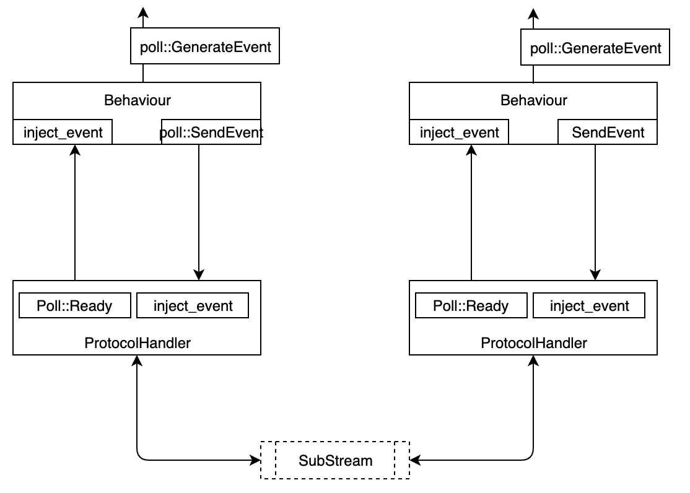

# Behaviour和ProtocolsHandler
## Behaviour
完成自定义的behaviour需要以下的工作：
1. 定义protocolHandler
2. 定义OutEvent，如果没有对外的输出，可以不管
3. 定义6个函数
### `new_handler`
这个函数在一个新的子流被创建的时候调用，它返回一个protocolsHandler，然后由这个handler进行协议协商
### `inject_connected` 
### `inject_disconnected`
### `inject_replaced`
### `inject_addr_reach_failure`
### `inject_node_event`
### `inject_new_external_addr`
### `inject_expired_listen_addr`
### `inject_dial_failure`
### `inject_new_listen_addr`
### `inject_listener_error` 
### `inject_listener_closed`
以上的`inject_`函数是在事件发生时的回调函数，其他的都直接望文生意，`inject_node_event`特别说明下：
1. 当收到子流发送的数据后，自动处理生成事件后，调用`inject_node_event`来通知处理
2. `inject_node_event`的实现者对消息进行处理，一般作处理后，再向上一层汇报（消息到达，或者消息已经处理），然后由上一层决定下一步的处理方案；另外也可以本层处理，比如找到转发的目标节点进行转发，不向上一层次汇报。
3. `inject_node_event`中的第三个参数需要在impl ProtocolsHandler for [ThisHandler] {...}里定义为OutEvent

### `poll`

# 特征 ProtocolsHandler
一个用于处理在远程连接上的一组协议的处理器。
本特性应该用于实现在远程连接上的一个特定协议的执行状态维护。  
## 处理协议
通过一组协议与远端的通信应该通过以下两个方法之一进行初始化：
1. 拨号并初始化一个新的出站子流。为了实现做个,[ProtocolsHandlr::poll()]必须返回一个[OutboundSubstreamRequest],提供一个[ProtocolsHandler::OutboundUpgrade]实例用于协商通信协议。一旦成功，将使用升级后的输出调用[ProtocolsHandler::inject_full_negotiated_outbound]。
2. 监听并且接收一个新的入站子流，当在链接上创建一个新的入站子流时，[ProtocolsHandler::listen_protocol]将被调用以获得一个[ProtocolsHandler::InboundUpgrade]实例用于通信协议协商。一旦成功，将会以升级后的输出调用[ProtocolsHandler::inject_full_negotiated_inbound]。
## 连接保持
`ProtocolsHandler`可以通过[ProtocolsHandler::connect_keep_alive]来影响下面连接的生命周期。换句话说，处理器实现的协议可以包括终止连接的条件。 协商成功的子流的生命周期完全由处理器控制。  
本特征的实现者必须注意连接可能在任何时刻被关闭。当一个连接被优雅地关闭，该处理器使用的子流仍旧可以继续读取数据，直到远端也关闭了这个连接。

## 实现自己的 ProtocolsHandler
### 五个类型
1.  type InEvent ;
2.    type OutEvent ;
3.    type Error ; // TODO: better error type?
4.    type InboundProtocol ;
5.    type OutboundProtocol ;

### 七个函数 

#### `listen_protocol-> -> SubstreamProtocol<Self::InboundProtocol>`

#### ` fn inject_fully_negotiated_outbound`

#### `inject_fully_negotiated_inbound`

#### `inject_event`

#### `inject_dial_upgrade_error`

#### `connection_keep_alive` 

#### `poll`

## ProtocolsHandler和Behaviour的关系
1. ProtocolsHandler的实例在Behaviour的new_handler函数里被创建并且返回
2. ProtocolsHandler的实际类型需要在Behaviour的实现中被声明（type PrtotocolsHandler = ... )
3. Behaviour的poll函数需要返回NetworkBehaviourAction<InEvent,OutEvent>类型
4. NetworkBehaviourAction有两个最重要的函数，GenerateEvent和SendEvent,GenerateEvent向上一层汇报事件，SendEvent向对端发送数据
5. ProtocolsHandler处理从子流收到的消息，然后在poll函数中通过Poll::Ready()返回给behaviour,事实上，是库中调用了handler的poll函数后，根据结果调用Behaviour::inject_event插入到Behaviour中
6. 
## 流程

# 子流和升级
由于一个swarm里仅有一个Behaviour对象，而每个连接建立时，Behaviour使用new_handler创建一个新的ProtocolsHandler。  
一个连接下可以支持多个虚拟子流，这个实现最典型的是KAD网络，因为KAD网络本身不需要支持长连接，所有的Ping/Pong，Find/Resp都是在一段时间后就可以结束。这种情况下，最理想的是使用单次的非流式结构，而libp2p是建立在流式工作的基础上的，为了维护多次的连接，并且降低连接/断开成本，可以使用虚拟子流。

## 定制
可以看出，自定义Behaviour/ProtocolsHandler是一件非常复杂的工作，所幸在substrate里，提供了一个GenericProto的类，来简化自定义behaviour的工作