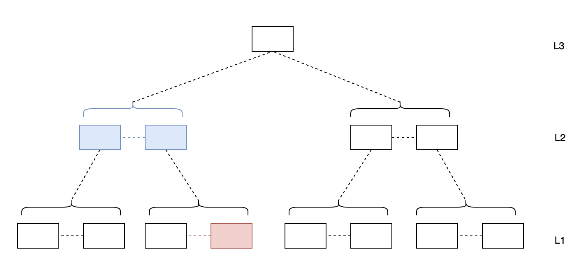

# 资料说明
##  [协议：轻节点友好型的数据跟踪](https://github.com/paritytech/substrate/issues/131)
从外部应用程序的角度来看，节点的用例分为两类：检查和通知。仅使用区块头进行链同步，并且通常不验证块中外部数据的轻客户端，必须特别注意以确保它们能够高效实现这两个用例。

使用以前的以太坊和比特币的设计方案，很容易提供对（存储或链的）检查：公需使用在区块头同步中提供的默克尔根，全节点（或者是已经具有必要信息的轻节点）可以提供存储中的某个值的证明。

但是，"通知"很难作为低信任度服务提供，因为不能高效地从存储的默克尔根区块中得到（该区块）不包含会引起（感兴趣的）状态变化某个外源操作的证据。 *这句话的意思是，如果某些外源操作可能会引起某个（我们感兴趣的）状态的变化，当这个状态变化时，我们很难证明区块中包不包含其中的某一条或是多条，可能的办法之一就是通过遍历区块中的所有外源操作--译者注*。在以太坊中，通过在每个块中整理一个较大的（2KB）Bloom过滤器并将其嵌入区块头来解决的。随着以太坊的使用激增，Bloom变得饱和，这使区块头变得臃肿却毫无效果。

相反，我提出了三种用于解决substrate上状态更改通知的机制，将其中两种（后两种）结合起来很有意义：

* 跟踪存储中的上次修改时间条目；
* 提供所有修改后的存储条目的默克尔字典树根目录（排序和索引过的）；
* 在一系列有序和索引过的块中，提供所有修改后的存储条目的默克尔根的层次结构。

### 跟踪存储中的上次修改时间条目
当前，存储数据库是一组键值对。这些对安排成默克尔字典树并且融合成单个"根"哈希。该提议将简单地在该值之前加上最后修改该值的区块号。

同步后的轻客户端可以轻松查询证明服务器有关所需存储项目的最新更改时间。证明服务器可以证明发生更改的最近区块（与轻客户端已知的区块头或是该头之前一些区块相比）。轻客户端可以请求一个或多个存储键的某些开始和结束块之间的更改日志，并且证明服务器将返回这些证明链，作为在所有这些区块中，有其中一个或多个存储条目已更改的无可辩驳的证据。

这种方法存在一个问题：已删除的存储条目在数据库中仍然会占用空间，这对于记录其"最后修改"（即已删除）的块是必要的-如果没有这些数据，轻型客户端将失去查询其历史更改日志的能力。（略微不佳的）解决方法是使用特殊的"垃圾收集"块，在这些块中，将这些僵尸条目从数据库中清除（因此从Trie中清除）。轻客户端将确保在这些期间中的每个期间内始终至少发出一个更改日志请求。  
这将使数据库中的每个存储条目增加大约32个字节（对应于区块编号）。它不会对磁盘​​I / O产生太大影响，并且标头大小将保持不变。但是，对于具有大量更改的存储，构建和执行这些垃圾收集块可能会成为一个严重的效率问题。

### 排序过，被索引，默克尔字典化的（每区块）更新字典
该提案创建了一个新结构，该结构对所有更改进行了编码，其实质与Bloom过滤器并无不同。此结构采用trie根构建的形式，作为索引到存储键的映射。索引是顺序的，并按存储键值排序。像布隆过滤器一样，它给出了块中已更改内容的密码学摘要。与布隆过滤器不同，证明给定密钥没有更改的证据不仅是可能的而且是紧凑的。

要证明给定的键值没有变化，证明服务器在键值的两侧各提供两个(Index, Key)条目。（用null作为标识值，即(ChangedKeyCount, null)表示上限，以便在所查询的键值大于修改后的键值的上限时提供证据。）

原则上，该Trie还可以包含的第二个映射表：(Key, [ ExtrinsicIndex_1, ExtrinsicIndex_2, ... ])以指示块中的哪些外部操作实际上导致了键值的更改。

### 分且扩展
虽然这可以在任何给定的块中有效证明一个或多个键没有更改（或者是如果更改了键，可以给出引起更改的特定外部信息），用例通常需要确定一系列块的使用情况。

但是，这种结构适合于分层方法：每隔N块，字典树将包含一个额外的entry ('digest', DigestChangeTrieRoot)。DigestChangeTrieRoot将是类似的trie结构的根，除了它将包含先前N块中帐户修改的累积值。相对于前面所述的包括任何给定键更改的ExtrinsicIndex，它包含导致键值更改的区块号，从而允许通过对数级Olog(N)的查询/证明来有效地识别(导致键值变化的）外源操作。

该结构可以嵌套和任意递归。N可能合理地设置为16、32或256，并相应地递归4、3或2次，以使顶级特里覆盖的最大块范围为32768或65536。

轻客户端将批量查询证明服务器，一次跳过顶级范围的块。证明服务器将返回带有任何感兴趣的证据的证明，或者返回发生了更改的子范围（以及在那里更改的密钥）。轻客户端会在该子范围内重新查询，向下钻取，直到他们确定外源操作的确切集合为止。原则上，可以在服务器端准备整个查询，并使用最少的带宽/延迟将所有内容的编译后的证明构建并发送回轻客户端。

### <span id="comment">附加注解</span>
我不确定我是否一定会称其为"紧凑的不存在证明"。给定来自的普通merkle映射A => B，您可以证明a具有单个merkle分支的元素不存在（这证明查找在到达值之前终止）。这些证明需要两个，尽管它们通常会共享一个较长的公共前缀。

要考虑的主要问题是产生这种证明的复杂性。用二分法对0到ChangedKeyCount进行搜索并找到ChangedKeyCount将需要进行(log(n))^2 + log(n)数据库访问。评估它只是log(n)因为我们可以指定要查看的索引。创建Trie（字典树）的成本甚至更高，因为我们需要累积所有键，然后在创建Trie之前对它们进行排序。如果有很多键发生了更新，所有这些操作最终可能会非常昂贵。使用常规的merkle字典树，只需使用log(n)时间即可创建和评估存在和不存在的证据。排序证明方法的确为任意较大范围的密钥提供了相当紧凑的非替代性证明，但是很难得到哈希存储的优点。

在跟踪更新时要求在每个块中都获取它们并不是轻量级客户端。我建议使用Δ-trie映射，idx => (key, last_changed)或者简单地说key => last_changed，以存储值的Merkle证明开头的轻客户端可以仅在某些情况发生变化并且确信没有遗漏任何东西时才获得存在证明。这是其他区块链轻型客户的痛点。如果我们向节点订阅了相关的更新推送服务，并且我们知道在将来某个时候存在的验证器集，那么我们甚至不必同步整个标头链。我们只需要推送给我们相关的标头和对应的Δ-trie证明。

如果last_changed每个密钥的都存储在状态Trie中，则仅当我们假设旧状态不可用时才有必要在分级范围内进行扩展，这将是令人振奋的，如果历史状态仍然可用，我们可以从当前跳到last_changed感兴趣的历史记录点。**这个其实是1，导致数据无法删除**

## 轻节点友好的数据跟踪： 更新字典和区块域扩展的实现：
**注： 这个是在substrate中的更新字典和区块域扩展的实现的pull request中的说明，此处只是用来加深对这个概念的理解，实际的实现已经超过了这里说明的范围。**    
字典构建在每个块的末尾，并且包含了"已经更新的键值"-->"引起更新的外源交易索引"的映射。例如，如果extrinsic＃5已将FreeBalanceOfAlice从500更改为400，而extrinsic＃8已将FreeBalanceOfBob的免费更改从300更改为200，则更改（字典）输入将是：
```
[
  FreeBalanceOfAlice => [5],
  FreeBalanceOfBob => [8],
]
```
请注意，与[＃131](https://github.com/paritytech/substrate/issues/131)的原始描述相比，根据此[注释](https://github.com/paritytech/substrate/issues/131#issuecomment-381678115)，如果没有[index => key]对，请输入。

有2个配置参数会影响更改的创建（现在它们是在创世时配置的，以后不能更改-有关此信息，请参见TODO）：

* digest_interval-每个digest_interval块更改都将包含level1-digest：将更改的键映射到以前的digest_interval-1块已更改的块数；
* 摘要级别-层次摘要的最大级别。将在每个digest_interval ^ 2块中创建level2的摘要，并包含先前的digest_interval-1 level1摘要中的所有已更改键。等等。
摘要构建示例：
```
let configuration = { digest_interval: 16, digest_levels: 3 };
let block = 4096;
let changes_trie = [
  map[ changed key of block#4096 => Set<ExtrinsicIndex> ],
  map[
    changed key of last 15 blocks#[4081, 4082, 4083, 4084, 4085, 4086, 4087, 4088, 4089, 4090, 4091, 4092, 4093, 4094, 4095]
      => Set<BlockNumber>
  ],
  map[
    changed keys of last 15 level1-digests at blocks#[3856, 3872, 3888, 3904, 3920, 3936, 3952, 3968, 3984, 4000, 4016, 4032, 4048, 4064, 4080]
      => Set<DigestBlockNumber>
  ],
  map[
    changed keys of last 15 level2-digests at blocks#[256, 512, 768, 1024, 1280, 1536, 1792, 2048, 2304, 2560, 2816, 3072, 3328, 3584, 3840]
      => Set<DigestBlockNumber>
  ],
]
```
更改尝试是可选的，并根据运行时请求进行构建。为了宣布它想创建更改，运行时为基板提供了配置。在块的末尾，如果已设置config，则计算更改的根的根并将其存储在块头中。更改操作的节点在导入操作提交时保存在数据库中。

读取更改将尝试一定范围的块，整个节点可以找到所有（块，外部）对，其中通过调用key_changes方法已更改了给定密钥。全节点可以为key_changes轻节点提供执行证明。

待办事项：

* 在Fetcher/ OnDemand级别添加key_changes证明请求&&响应
* 使用（1）清除轻节点上的TX池
* 支持更改修剪-我们可以在非归档完整节点上修剪早于digest_interval ^ digest_level的更改尝试
* 支持"开启"更改以前未使用过的链的Trie功能
* 缓存映射[ changed key => block number ]以加快摘要创建

# ChangesTrieConfiguration
## 理解说明
这个是以太坊的布隆过滤器的替代方案，是用于能够迅速地定位导致数据变化的是/不是由某个外源操作引起的，可以看成是可以快速进行不存在证明的事件记录器。  

* 第三层定位在第二层的哪个位置（蓝色部分）
* 第二层定位在第1层的哪个位置
* 第一层再次定位在哪个区块

## 实现
**这个实现并没有完全按照上面的第二部分做，上面的第二部分仅用于增加理解**
```rust 

/// Substrate changes trie configuration.
#[cfg_attr(any(feature = "std", test), derive(Serialize, Deserialize, parity_util_mem::MallocSizeOf))]
#[derive(Debug, Clone, PartialEq, Eq, Default, Encode, Decode)]
pub struct ChangesTrieConfiguration {
    /// 表明level1-摘要创建的间隔（以区块为单位）当这个小于等于1时，摘要将不会被创建
    pub digest_interval: u32,
    ///继承中层次中最大的摘要水平的数值。 0表示不创建任何摘要（即使是level1摘要），
    ///1表示创建level1摘要，2 表示每digest_interval^2产生level2-摘要，依次类推，3 表示每digest_interval^2产生level2-摘要,然后每digest_interval^3产生level3-摘要
    /// 必须保证最大的摘要间隔(即 digest_interval^digest_levels)在`u32` 的取值范围内，否则你可能永远无法实现如果大间隔的摘要，并且这个值将会被`u32`的限制所截断
    pub digest_levels: u32,
}
```
```rust
/// Substrate changes trie configuration range.
#[derive(Debug, Clone, PartialEq, Eq)]
pub struct ChangesTrieConfigurationRange<Number, Hash> {
    /// Zero block of configuration.
    pub zero: (Number, Hash),
    /// Last block of configuration (if configuration has been deactivated at some point).
    pub end: Option<(Number, Hash)>,
    /// The configuration itself. None if changes tries were disabled in this range.
    pub config: Option<ChangesTrieConfiguration>,
}
```

### ChangesTrieConfiguration的特征
* `pub fn new(digest_interval: u32, digest_levels: u32) -> Self` 创建
* `pub fn is_digest_build_enabled(&self) -> bool`是否使能
* `pub fn is_digest_build_required_at_block<Number>(`在给定的区块上是否需要创建digest
* `pub fn max_digest_interval(&self) -> u32 {`最大的摘要间隔
* `pub fn prev_max_level_digest_block<Number>(`  最深层次的上次创建digest的区块号
* `pub fn next_max_level_digest_range<Number>(`
* `pub fn digest_level_at_block<Number>(&self, zero: Number, block: Number) -> Option<(u32, u32, u32)>`