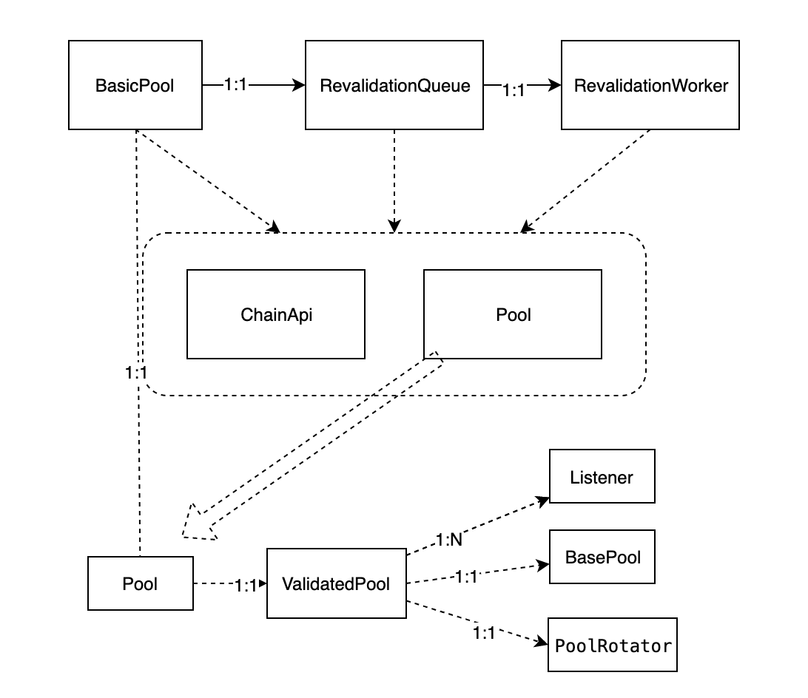

# 说明
Transaction-pool是系统使用的交易池，除了并管理无状态的交易（比如说发送一条转帐命令）之外；交易池还管理有状态的交易，有状态的交易是指可以需要某个条件后到达（比如说区块号大于多少）才能够生效的交易。

系统通过几个xxx_at（例如submit_at,validate_at)实现有状态的交易，另外通过Tag属性来进行交易的状态化。Tag是指交易有效之前需要的标识。  

有了这套体系，可以方便地实现需要状态的交易，比如投票需要等到某个区块到达后才可以开始，委员会选举的reveal阶段需要等到最低投票人数到达后才可以开始等。

transaction-pool是非常重要的一个类，这个类的理解对于整个substrate是如何驱动运转的会有很大的帮助，因此在本文详细介绍各个目录、文件、模块甚至是实现函数。

我们按照transaction-pool目录下的各个文件分开说明

# src目录下的类说明
src目录下除了`error.rs`之外，主要提供了三个文件：
1. `lib.rs` 基本的类说明文件，并且定义了几种pool类的接口以及basicpool类的实现；
2. `api.rs`定义了基本的ChainApi的接口，并且实现了`FullChainApi`和`LightChainApi`；
3. `revalidatetion.rs`：定义了一个`RevalidationWorker`,是Revalidate的工作线程。
## src目录下的模块结构
模块结构如下图：



**总结，其实transaction-pool的使用很简单**
# transaction-pool核心用户操作
transaction-pool的核心操作有两点，
1. 提交一个Extrinsic交易，这个交易 
    1. 数据格式能够被分派到对应的pallet进行处理.
    2. 依赖关系已经配置好,如何配置依赖关系，请查阅[这里](../../transaction-pool/graph/概要.md)
2. 对收到的广播Extrinsic交易进行导入处理（导入过程包括了判定有效性的过程）
其余的部分，都由transaction-pool内在的功能处理完毕 

## 如何生成可以被分派的数据 （1.1）
1. 在相应的runtime中，定义 Extrinsic
2. 生成Checked/UncheckedExtrinsic
3. 通过submt_at提交给交易池

## 启动验证（1.2）
需要实现`sp_transaction_pool::runtime_api::TaggedTransactionQueue<Block>`特征:
```rust
	impl sp_transaction_pool::runtime_api::TaggedTransactionQueue<Block> for Runtime {
		fn validate_transaction(
			source: TransactionSource,
			tx: <Block as BlockT>::Extrinsic,
		) -> TransactionValidity {
			Executive::validate_transaction(source, tx)
		}
	}
```