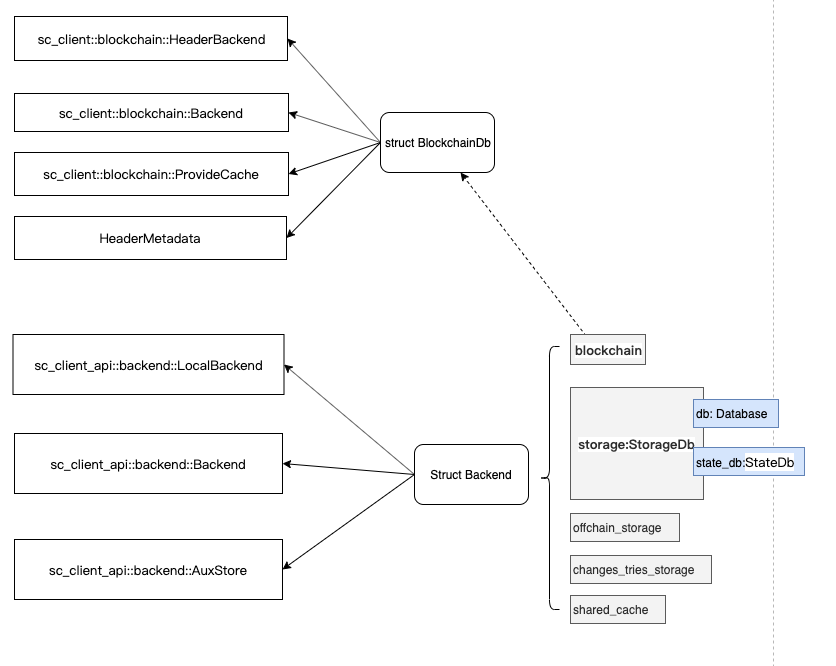

# 说明 
这个对backend的理解和说明


Backend的由三个部分构成：
* `primitives/blockchain/src/backend.rs`：抽象的对区块头操作的接口
* `client/api/src/backend.rs`： 提供对区块有关操作的接口，对区块头的操作也被包含进来了
* `client/db/src/lib.rs`： 实际的数据层处理


## Blockchain/Backend
首先是对primitives部分的理解：
* Backend是由HeaderBackend和HeaderMetadata两个trait特征

### HeaderBackend
这个是区块链的区块头的数据库的抽象，是已经验证过的区块头的读写（换句话说，这里并不执行任何的验证）。 这个trait包括以下的接口:
```rust
pub trait HeaderBackend<Block: BlockT>: Send + Sync {
	/// 根据BlockId获取实际的区块头Header,如果没找到，则返回None
	fn header(&self, id: BlockId<Block>) -> Result<Option<Block::Header>>;
	/// 获得有关本链的信息，本链的信息指：最优hash/最优区块高度/创世哈希/最终确定化的区块的哈希/最终确定化的区块高度/当前分支数(详情见Info结构)
	fn info(&self) -> Info<Block>;
	/// 返回某个区块在链中的状态，状态只有两种（InChain在链内，Unknown未知，为啥没有不在这个状态？）
	fn status(&self, id: BlockId<Block>) -> Result<BlockStatus>;
	/// 获取哈希对应的区块高度，如果链中没有这个哈希的区块，返回None
	fn number(&self, hash: Block::Hash) -> Result<Option<<<Block as BlockT>::Header as HeaderT>::Number>>;
	/// 返回某个高度对应的区块的哈希. 如果没有该高度的区块，返回`None`
	fn hash(&self, number: NumberFor<Block>) -> Result<Option<Block::Hash>>;

	/// 将某个blockID转换成哈希（blockID可能是高度或是哈希，如果是哈希，直接返回，如果是高度，通过self.hash获取后返回.
	fn block_hash_from_id(&self, id: &BlockId<Block>) -> Result<Option<Block::Hash>> {
		match *id {
			BlockId::Hash(h) => Ok(Some(h)),
			BlockId::Number(n) => self.hash(n),
		}
	}

	/// 将某个blockID转换成哈希（blockID可能是高度或是哈希，如果是高度，直接返回，如果是哈希，通过self.header获取其高度后返回.
	fn block_number_from_id(&self, id: &BlockId<Block>) -> Result<Option<NumberFor<Block>>> {
		match *id {
			BlockId::Hash(_) => Ok(self.header(*id)?.map(|h| h.number().clone())),
			BlockId::Number(n) => Ok(Some(n)),
		}
	}

	/// 返回blockID对应的区块头，blockID可能是高度或是哈希
	fn expect_header(&self, id: BlockId<Block>) -> Result<Block::Header> {
		self.header(id)?.ok_or_else(|| Error::UnknownBlock(format!("Expect header: {}", id)))
	}

	/// 类似block_number_from_id，在失败时返回'UnknownBlock'
	fn expect_block_number_from_id(&self, id: &BlockId<Block>) -> Result<NumberFor<Block>> {
		self.block_number_from_id(id)
			.and_then(|n| n.ok_or_else(||
				Error::UnknownBlock(format!("Expect block number from id: {}", id))
			))
	}

	/// 类似`block_hash_from_id`,在区块不存在时返回 `UnknownBlock` 
	fn expect_block_hash_from_id(&self, id: &BlockId<Block>) -> Result<Block::Hash> {
		self.block_hash_from_id(id)
			.and_then(|n| n.ok_or_else(||
				Error::UnknownBlock(format!("Expect block hash from id: {}", id))
			))
	}
}
```

### HeaderMetadata
HeaderMetadata是处理区块头的元数据的特征，元数据是指区块头中的哈希/高度/父哈希等。之所以把这些数据抽出来，是为了可以通过这些做成缓存或是索引，以加快区块头的访问速度。 实际上，在header_metadata.rs文件中，为headerMetadata实现了cache之外，另外还提供了一个TreeRoute类，这个类是为了寻找从一个分叉中的区块到另外一个分叉中的区块的路径：
```text
从R1到E2区块的TreeRoute，回撤[R1, R2, R3], 公共祖先是 C, 重新导入 [E1, E2]
  <- R3 <- R2 <- R1
 /
C
 \-> E1 -> E2
```
///
```text
从 C 到 E2的TreeRoute. 回撤为[]. 公共祖先是 C, 重新导入 ß [E1, E2]
C -> E1 -> E2
```
事实上，HeaderMetadata是为TraceRoute服务的

实现了以上两个特征约束后，Backend具有以下的接口：
```rust
pub trait Backend<Block: BlockT>: HeaderBackend<Block> + HeaderMetadata<Block, Error=Error> {
	/// 获取区块体，如果区块不存在，返回 `None` 
	fn body(&self, id: BlockId<Block>) -> Result<Option<Vec<<Block as BlockT>::Extrinsic>>>;
	/// 获取区块的确认证据，如果确认证明不存在，返回 `None` 
	fn justification(&self, id: BlockId<Block>) -> Result<Option<Justification>>;
	///得以最新的最终确定化区块的哈希
	fn last_finalized(&self) -> Result<Block::Hash>;
	/// 获取区块cache，如果在backend已经使能的话
	fn cache(&self) -> Option<Arc<dyn Cache<Block>>>;

    /// 返回区块树中的所有叶子节点，叶子节点的意思是没有子节点的区块，即如上述中的R1和E2节点
	/// 结果必须是按照由最好（最长、最重）开始的排序好的
	fn leaves(&self) -> Result<Vec<Block::Hash>>;

	/// 获取parent_hash中的所有的子区块（可能是分叉的）.
	fn children(&self, parent_hash: Block::Hash) -> Result<Vec<Block::Hash>>;

	/// 获取包含给定的`target_hash`的最好（最长？）的链分叉的最近区块、	///
	/// 总是把查询的范围限制在已经最终确定化的分支中
	///
	/// 如果 `maybe_max_block_number` 是 `Some(max_block_number)`
	/// 查询就被限制在 `numbers <= max_block_number`范围中，
    /// 换句话说如果 如果`target_hash`的区块高度大于`max_block_number`，
    /// 即使找到了，也`Ok(None)`
	fn best_containing(
		&self,
		target_hash: Block::Hash,
		maybe_max_number: Option<NumberFor<Block>>,
		import_lock: &RwLock<()>,
	) -> Result<Option<Block::Hash>> {
		
	}
}
```

由上述设计可以看出，Primitive中的Backend是存储区块头的数据库，并且提供了一系列方便操作链的接口，我们推测还需要对区块内容进行操作的Backend扩展，对这个Backend进行实例化的Backend,因此我们看`client/api/src/backend.rs`中的Backend

## api/Backend
此处的Backend是可实例化的backend，管理了区块链的数据层。既包括了区块内，还包括了数据的状态等各种信息。  
注意：在状态剪裁过程中，如果`state_at`中的某个对象还存在，`state_at`就不能被剪裁，因此backend中需要在内部实现一个所有对象的引用计数器。  
此规则同样在应用`BlockImportOperation`时适用：当一个`P`为父节点的导入动作处于活动状态时，`P`的状态同样不能被剪裁。  
### 四个关联类型
一个backend需要四种类型对象：
* BlockImportOperation 区块导入的操作定义
* Blockchain：区块头相关的操作定义 
* State：    区块体内容及状态数据存储的相关定义
* Offchain： 离线存储相关的定义

```rust
	/// Associated block insertion operation type.
	type BlockImportOperation: BlockImportOperation<Block, State = Self::State>;
	/// Associated blockchain backend type.
	type Blockchain: BlockchainBackend<Block>;
	/// Associated state backend type.
	type State: StateBackend<HashFor<Block>> + Send;
	/// Offchain workers local storage.
	type OffchainStorage: OffchainStorage;
```

### 接口函数
#### 开始/提交操作
这一组有三个函数：
```rust
    /// 开始根据给定的父区块ID，向某个区块插入数据，注意返回的是一个BlockImportOperation
	/// 当构造创世区块人的时候，这个总是使用全零哈希来构造
	fn begin_operation(&self) -> sp_blockchain::Result<Self::BlockImportOperation>;

	/// 告诉某个BlockImportOperation，使用某个区块高度的状态
	fn begin_state_operation(
		&self,
		operation: &mut Self::BlockImportOperation,
		block: BlockId<Block>,
	) -> sp_blockchain::Result<()>;

	///数据插入完毕，提交该区块
    fn commit_operation(&self, transaction: Self::BlockImportOperation) -> sp_blockchain::Result<()>;
```
显然，这三个函数是在执行区块的时候需要进行的操作。并且从名称`BlockImportOperation`中也显然可以看出，区块生成的过程和import的过程统一了，即当要生成区块时，准备好区块头和区块体中的交易，然后使用与begin_operation后进行begin_state_operation，然后进行各种交易执行，交易执行完毕后，使用commit_operation提交结果。我们再看另外几个接口：

#### 最终确定化区块
最终确定化区块是在链中标识某个区块被最终确定化了，block是BlockId类型的区块标识，即可能是哈希，也有可能是区块高度（假如目前这个区块高度上只有一个区块？或者是最好的？）。而justification是这个区块可以最终确定化的证明，这个可以是None.
```rust
	fn finalize_block(
		&self,
		block: BlockId<Block>,
		justification: Option<Justification>,
    ) -> sp_blockchain::Result<()>;
```
这个函数的注释里有一句话，”此函数仅仅在给定节点的父节点已经被最终确定化后才可以调用”，由此可推知，区块必须被逐块最终确定化，不能跳跃，那反过来说，假设我们最终确定化了一系列的区块，也需要从这系列区块的最起始区块开始，逐块调用。


#### 区块头处理对象引用
```rust
fn blockchain(&self) -> &Self::Blockchain;
```
返回处理BackendHeader的对象

#### 当前的状态
当前的状态，UsageInfo是个在内存中还是数据库中的枚举对象。
```rust
    fn usage_info(&self) -> Option<UsageInfo>;
```

#### 更新字典
更新字典用于记录世界状态中被更新的键值和导致这个更新的对应的外源操作，用于实现某个外源操作不存在证明。存在证明容易，找到就可以，不存在证明比较麻烦，如果不做处理，需要遍历所有的区块中的打包的外源即复杂度是O(N)，通过更新字典可以把复杂度降低到O(logN)
详细的更新字典的说明见[这里](../../../Substrate代码研究/substrate库/primitive/core/src/changes_tries.md)
```rust
    fn changes_trie_storage(&self) -> Option<&dyn PrunableStateChangesTrieStorage<Block>>;
```
这是一个option对象，意味着可以启用或是不启用。

#### 返回离线存储对象
```rust
fn offchain_storage(&self) -> Option<Self::OffchainStorage>;
```

#### 状态相关
* 是否有该区块的状态？
```rust
	/// Returns true if state for given block is available.
	fn have_state_at(&self, hash: &Block::Hash, _number: NumberFor<Block>) -> bool {
		self.state_at(BlockId::Hash(hash.clone())).is_ok()
    }
```
* 获取某区块高度的状态根
```rust
	/// Returns state backend with post-state of given block.
	fn state_at(&self, block: BlockId<Block>) -> sp_blockchain::Result<Self::State>;
```

#### 回滚
试图向前回滚`n`个区块，如果`revert_finalized`设置为true，那么回滚过程中将无视那些已经被最终确定化的块，这是非常不安全的。 从正常的逻辑来说`revert_finalized`为false，应该是回滚`n`个区块或是碰到第一个已经最终确定化的块时结束。
返回一共回滚的区块个数
```rust
	fn revert(
		&self,
		n: NumberFor<Block>,
		revert_finalized: bool,
    ) -> sp_blockchain::Result<NumberFor<Block>>;
```
#### 辅助存储相关
辅助存储是提供给应用端的，不需要存储在状态根中，但是在处理过程中又有可能需要用到的数据存储
* 插入K-V数据 
```rust
fn insert_aux<
		'a,
		'b: 'a,
		'c: 'a,
		I: IntoIterator<Item=&'a(&'c [u8], &'c [u8])>,
		D: IntoIterator<Item=&'a &'b [u8]>,
    >(&self, insert: I, delete: D) -> sp_blockchain::Result<()>
```
* 根据键获取值
```rust
fn get_aux(&self, key: &[u8]) -> sp_blockchain::Result<Option<Vec<u8>>> 
```
#### 导入锁
获取允许导入的锁
_注意_ Backend本身从来不需要获取这个锁，使用者组件应该在他们如果在可能被区块导入动作影响的操作时--比如导入一个新区块或者计算最好的区块头，获取并且维持这个锁。 
```rust
fn get_import_lock(&self) -> &RwLock<()>;
```
## db/src/backend
在实际的过程中，轻节点和全节点的数据存储和处理方式是不一样的，因此有两种实现
//TODO 后续再写出详细 的说明 