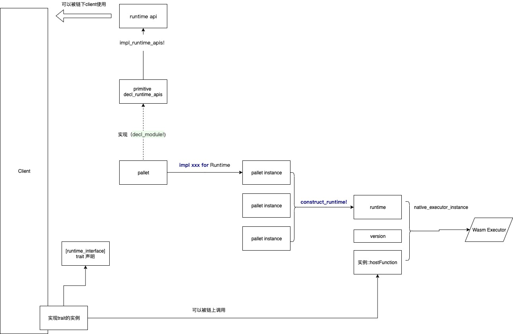

# 描述


## 使用扩展实现链上调用链下的实例
（参考TransactionPoolExt)  
1. 定义extension
    ```rust
        #[cfg(feature = "std")]
        sp_externalities::decl_extension! {
            /// An externalities extension to submit transactions to the pool.
            pub struct TransactionPoolExt(Box<dyn TransactionPool + Send>);
        }
    ```   
    上述语句使TransactionPool实现了Extexternality的基本功能（`Deref`,`DerefMut`),也使得`self.extension::<TransactionPoolExt>()`返回这个里面的内容
2. 注册这个扩展
   ```rust
   extensions.register(TransactionPoolExt(Box::new(TransactionPoolAdapter {
					at: *at,
					pool,
				}) as _));
   ```
   上述语句在client/api/src的manage_extension中，向externsion中注册了TransactionPoolExt
3. 定义runtime_interface，并且在其中的某个函数中使用TransactionPoolExt扩展
    ```rust
    #[runtime_interface]
        pub trait Offchain {
            //...
            fn submit_transaction(&mut self, data: Vec<u8>) -> Result<(), ()> {
                self.extension::<TransactionPoolExt>()
                    .expect("submit_transaction can be called only in the offchain call context with
                        TransactionPool capabilities enabled")
                    .submit_transaction(data)
	        }

            //...
        }
    ```        
 
### 不使用扩展实现链上调用链下
在不使用扩展时，唯一可以使用的是StateMachine中的::backend，这是一个状态树和对状态树的处理