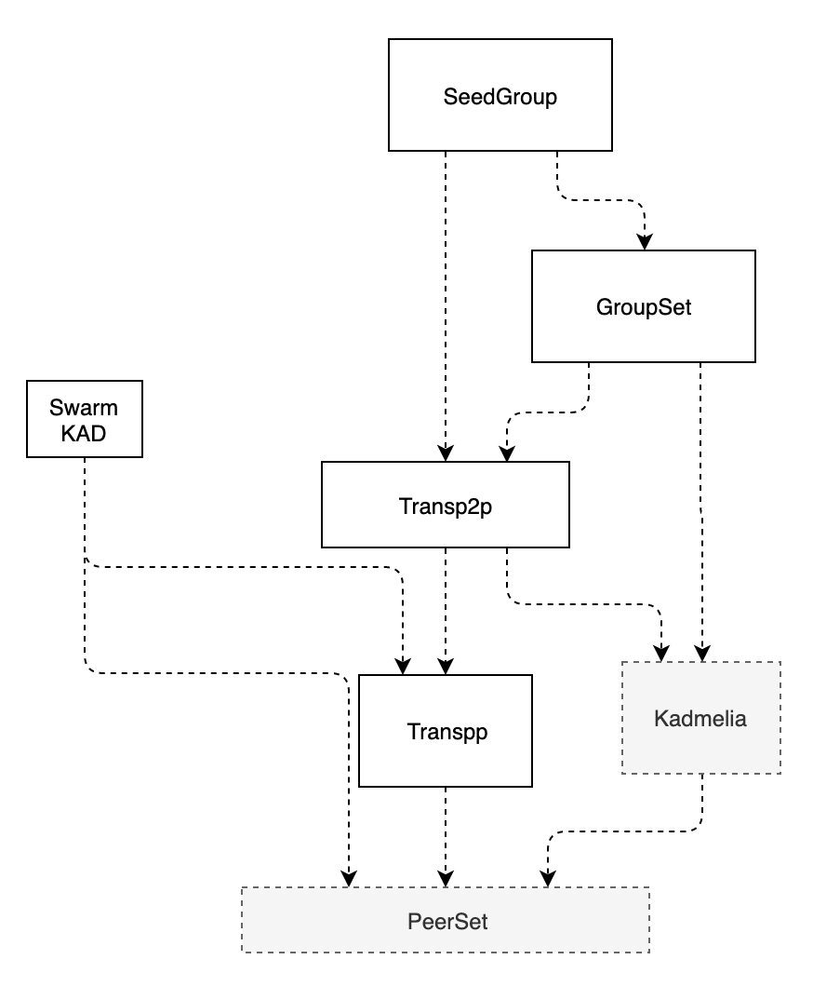

# 改造目标
1. 实现单播、组播
2. 非连接状态下的节点发现
   1. 或者使用UDP的虚拟连接？
3. 基于组播的客户端/服务器收发（可选）

# 改造方案

 改造后的网络层具有五大模块，其中
 1. Transpp是在原有的KAD网络上，加了一层通过push/pull方式发送数据的功能，这个方式与gossip相比，支持向指定的数个邻节点发送数据，同时数据不会重复传输
 2. Transp2p中有实现了具有路由功能的单播，与DHT不同，transp2p的路由是通过发现后记录在模块中的，实现了定路由，通过此方式提高转发的效率。
 3. Swarm KAD是简化版的Kadmelia实现，没有实现标准的get/put_value和get/put_provider，但是添加了饱和区和责任区的概念，关于饱和区和责任区的概念
 4. GroupSet提供群组创建、加入、退出、组播等功能
 5. SeedGroup实现了一类特定形式的分组，该分组由一个或多个seed节点作为源，形成分组，全节点可以动态加入此分组充当分发器，轻节点可以请求某些全节点加入此分组，同时可以实现客户端与seed节点之间的双向数据传输
## Transp2p模块
* Transp2p模块用于通过DHT网络进行数据传输，在原有的DHT不定路由的基础上，实现定路由功能。
* Transp2p通过Kadmeli实现路由发现，通过transpp实现邻节点之间的的无重复数据传输
### GroupSet模块
* GroupSet向上提供创建分组，加入分组、离开分组以及向分组广播数据的功能。
* 一个节点可能会属于多个分组，因此从同一个节点可能会收到属于多个分组的数据，groupset需要地收到的数据进行分析，确认属于哪个组后向上传播
### Delay Relay模块
* Delay Relay是允许延时发送的模块，提供数据的缓存和延时发送的功能，
* 同时提供未发送数据清除和数据发送完毕后的事件响应

 ## Transpp模块
 transpp模块提供最基本的向单个和多个邻节点发送的功能，数据发送是通过pull/push的模式进行的，即发送方先发送数据哈希，接收方查看此哈希，如果本地不存在此哈希，再向发送方请求该哈希对应的数据。通过此方式可以避免多余的数据传输。  如果数据区的长度很小（低于256字节），那么就直接传输数据而不需要进行多次数据交互
 Transpp中有一个缓冲区，用于记录某个哈希的来源节点，这样当某个哈希有多个来源节点时，如果从第一个来源节点上没有取到，可以从后面的来源节点获取
 ## 数据协议
 1. 流名称："trnspp/1"
 2. 命令有三个：
    1. PUSH_HASH   向邻节点发送一个哈希 
    2. PUSH_DATA   向邻节点发送一个数据
    3. PULL_DATA   请求邻节点传输数据
 链相关的分组名称两个字节构成：1字节类型和1字节的编号

