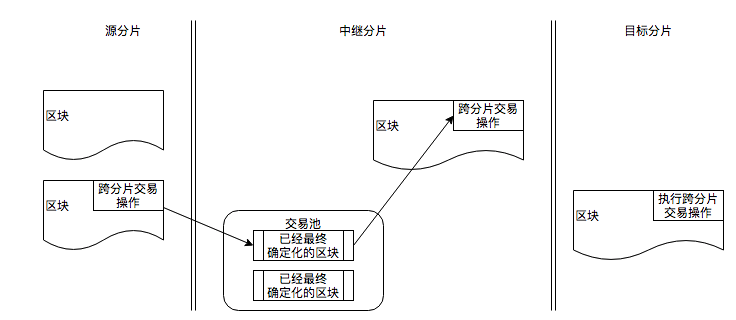

# 说明
在pnyx中，有大量的需要跨分片处理的交易，例如： 如果帐户Alice向Bob转移一笔资产，需要在Alice帐户中减去，然后在Bob帐户加上相应的值，在分片系统中，帐户alice和分属于两个不同的分片，要实现转帐的效果，需要做到以下的原子性：如果从Alice中扣除了资产，必须保证Bob中肯定能够收到资产；反之，如果从Alice中扣除失败，则肯定不会向Bob增加相应的资产。  
在实现上Alice所在的分片是无法也不应该关心Bob是否收到资产的，否则就会导致分片之间耦合性过强使系统无法工作。在Pnyx中，相应的处理方案是使用跨分片动作Cross-shard-actions，即需要跨分片处理的的动作，在原分片区块处理结束后，作为处理结果存放在区块体里，并且将对应的哈希放在区块头上。其他处理该区块的链，把这个区块看成是输入，然后处理区块体里的Cross-shard-actions。

# 跨分片中间结果的生成方式
中间结果生成有三种处理方式；
* 一种使用类似事件的方式进行，即提供接口给pallet，然后pallet中需要跨分片执行的中间结果，使用此接口记录需要跨分片交易的信息。  
* 另外一种方案使用返回值，我们设计一个跨分片中间类型，Call如果需要有跨分片执行的数据，就返回一个此中间类型； 
* 第三种方案，临时方案：增加一种内存中的数据存储模块，这个数据模块提供存入和取出两个接口，需要跨分片交易的操作，执行过程中将中间结构存到这个数据模块中。
* 
无论使用哪一种方式，Executive都需要在on-finalize时，收集这些记录。然后生成结果放到区块体里，然后将对应的哈希填充到区块头。由于
1. 第一种方式需要使用和修改现有的宏系统，实现新的保留函数，保留函数的定义见[此处](../../../Substrate代码研究/substrate框架/区块执行过程分析/dispatch.md)，
2. 第二种方式需要更新DispatchOutcome： 
    在目前的Callable的系统中，Applable中返回的`DispatchOutcome`是 `Result<(), DispatchError>`形式，因此我们需要做以下和工作；
    1. 定义一个跨分片交易的类`Intermediate`
    2. 更新`DispatchOutcome`的形式为`Result<Option<Intermediate>, DispatchError>`
    1. 所有的Extrinics执行后，收集`DispatchOutcome`的结果,然后根据此结果分类打包
    2. 分类打包后，数据本地存储，生成哈希(CID),在P2P系统中存储<CID，哈希>对。
3. 第三种方式需要附加一个模块

我们认为第二种方式是合理的具有任意可扩展性的方式,但是系统中使用了DispatchInfo来执行PostInfo，计算诸如部分交易重量的数据，因此选择的方案综合了1和3，具体如下：
1. 在System模块中添加一个存储项目，存储所有的跨分片交易的action
2. 提供保留函数generate_csa，可以将一个actionItem保存到存储项目中
3. 提供保留函数group_csa，这个处理是在finalize时候进行的，按照（分片、中继）分组存储项目中保留的actionItem，原始数据写入p2p存储器，哈希值记录
   1. 分片对原始交易的处理 group_raw_csa_of_shard
   2. 分片对中继交易的处理 group_relay_csa_of_shard
   3. 中继对分片交易的处理 group_shard_csa_of_relay   
   5. 中继对信标交易的处理 group_beacon_csa_of_relay
   6. 信标对中继交易的处理 group_relay_csa_of_beacon
   注意：原始的交易需要被写入P2p存储系统
数据参考：

# 详细设计

## 实现过程
在substrate中，区块的处理实现分成三个部分：
1. 区块结构的抽象，在这里抽象了区块头、区块体、区块交易以及实现相应的Callable和Applyable的接口，这个在primitive/runtime中定义，在这其中
   1. src/trait是区块有关接口的定义，以及类型约束
   2. src/generic/*是通用区块的一种抽象实现，更简单的实现可以直接参考 src/testing
2. substrate中的区块实现抽象，主要定义了本系统实现所需的的数据类型约束，这个在 frame/system中
3. 用户真正的实现，这个在node_template的runtime中

上述描述有点容易混淆，简单说，就是逐步从抽象到具体的过程，使实现者可以任意选择从某个层开始来定制自己的区块链。 要理解一个可执行交易（外源）的执行过程，请[查看这里](../../../Substrate代码研究/substrate框架/交易的执行过程.md)。

应该也是一个Appliable的特质，这样可以使用标准的方式进行执行

## 实现说明 
根据目前的substrate的通用框架，实现分成两个部分，
1. 与区块逻辑相关的部分，应该放在primitive/runtime里实现
2. 与实际的实现的链相关的部分，应该放到自身的的实例化frame/system化的过程中

Pnyx中跨分片交易有两个部分构成：
1. 交易执行项，需要跨分片处理的交易内容
2. 交易存储项：出块者将所有的交易执行项按需进行分组，分组后的结果形成哈希，然后将多组哈希组合，形成交易的存储项

根据上述描述，我们可以得出几个结论：
1。 交易的执行项并不在区块中存储，而是在区块外存储（可能是P2P存储）
2。 存储项和执行项是逻辑的区分，同一项在不同的链中将担任的不同角色。例如分片链的交易存储项是中继链的交易执行项。因此在实现中，我们统一称为跨分片交易项，简称交易项

### 流程
以一个交易为例，描述该交易在分片系统中的处理过程，这个处理过程中指持有该交易的数据结构的转换，转换后的数据在跨分片过程中被处理的过程。
我们首先定义某一个余额型的交易跨分片处理的对象元组R:(accountId,value)
1. 分片的处理：
   1. 在原始分片里，按照目标中继分组，每个分组里就是一个向量`Vec<(accountId,value)>`，这个向量生成哈希`HR`，得到与目标中继对应的一个元组`(RelayId,HR)`，
   2. 分片将`HR`对应的实际数据`Vec<(accountId,value)>`存入到P2P存储系统
   3. 按照目标中继分组将得到多个元组，记录该向量到区块`Vec<RelayId,HR>`
2. 中继的处理：
   1. 中继将收到多个区块，得到多个区块中的向量组`Vec<RelayId,HR1>`..`Vec<RelayId,HRN>`
   2. 中继根据向量组中的RelayId重新合并，得到目标是某个中继的一组{HR1,...,HRN}，然后生成该RelayId的新的哈希HJ=Hash(HR1,...,HRN)
   3. 中继在区块中打包Vec<(RelayId,HJ)>，然后广播
3. 信标的处理
   1. 信标将收到多个中继的区块，得到多个区块中的向量组`Vec<RelayId,HJ1>`..`Vec<RelayId,HJN>`
   2. 信标根据收到的向量组中的RelayId重新合并，得到目标是某个中继的一组{HJ1,...,HJN}，然后生成针对该RelayId的新的哈希HK=（HJ1,...,HJN)
   3. 信标在区块中打包Vec<(Relay,HK)>,然后广播
4. 目标中继的处理
   1. 目标中继(RelayId)收到信标区块，从区块中得到`Vec<(Relay,HK)>`，取出`HK`
   2. 接收节点向来源节点请求与自身的RelayId对应的HK数据，得到一组`{HJ1,...,HJN}`
   3. 接收节点向P2P存储请求，得到每个HJ对应数据`{HR1,....,HRN}`
   4. 接收节点向P2P存储请求，得到每个HR对应的数据`Vec<(accountId,value)>`
   5. 接收数据根据`Vec<(accountId,value)>`中accountId和当前的分片指数情况，重新按照分片处理，得到根据分片的一组向量`Vec<(accountId,value)>`,然后根据每个分片的向量生成哈希`HL`
   6. 这些HL形成向量`Vec<ShardId,HL>`,打包到区块中继内广播
5. 目标分片的处理
   1. 目标分片收到中继区块，从中继区块中得到`Vec<ShardId,HL>`
   2. 分片区块节点向来源的中继节点请求与自身ShardId对应的HL对应的向量数据`Vec<(accountId,value)>`
   3. 分片区块节点根据`Vec<(accountId,value)>`更新自身内帐户的余额信息

#### 弹性分片处理（目前只考虑扩展）
   当系统支持弹性分片时，原始的分片根据分片指数对交易进行分组，当这些分组后的交易被目标链处理时，分片指数可能已经变化了，因此原来的分组方案可能与新的不一致了，这时需要做特殊的处理：  
   下面的讨论我们做了如下的假设：
   1. 链中的区块只打包对应的链中高度比自己低的区块（如中继链N+1高度只打包分片链中不大于N+1的区块）
   2. 在区块高度为N+1时，需要进行弹性分片
   3. 以分片和中继为例，其余的类推，
   假设分片高度为N的区块被高度为N+1的中继区块进行处理，中继编号为A，分片编号为AB，这时候有两种情况：
   1. 假设是中继扩展一倍了，即分片指数从（R,S）升级成(R+1,S)
      1. 中继A分裂成A,2R+A
      2. 分片AB分裂成AB和2R+AB两个
      3. 在区块高度为N的时候，分片还没有分裂
      4. 在区块高度是N+1的时候，中继链A和2R+A都打包分片高度N的数据
      5. 由于高度已经是N+1了，因此中继链A和2R+A根据新的分片指数决定哪些数据需要自己处理，不需要处理的数据直接丢弃（应该被对端的分片处理了）
      6. 中继2R+A需要在所有管理分片中的第N个区块以及信标链的第N区块全部被处理后，才离开中继R所在的网络
   2. 或者是中继内的分片扩展一倍了，即分片指数从（R,S）升级成(R,S+1)
      1. 中继A不变
      2. 分片AB分裂成了AB和A(2S+B)
      3. 中继处理第N高度的AB
      4. 中继处理第N+1高度的AB和A(2S+B)
      5. A(2S+B)在N区块最终确定化后，退出AB网络

### 数据结构
#### CSActionItem
CsaActionItem是交易的执行项，即上述的Vec<Target,Data>，对于不同的交易类型，其Target和Data可能不同：
1. CsaTarget 
   Target无非三种：目标是某个分片、某个中继或是信标链，因此我们可以使用一个Enum来表示Target，这个正好是对于ChaiId
2. CsaData
   Data与实际的操作相关，目前我们已知的有：
   1. 增加资产
   2. 锁定写数据
   3. 写锁定数据回应
   4. 解锁写
   5. 读锁定数据
   6. 读锁定回应
   此处我们可以得知，未来Data是基于应用层的，与应用有关的数据结构，为了更加通用化，我们定义一个Trait来管理此类型
#### CSAResults
对于中继链，其跨分片交易的数据被分成了两部分，提供给Beacon的部分和提供自身所管理的Shard链部分。因此我们需要根据不同的类型定义不同的CsaReuslts.

