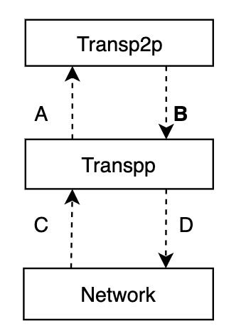
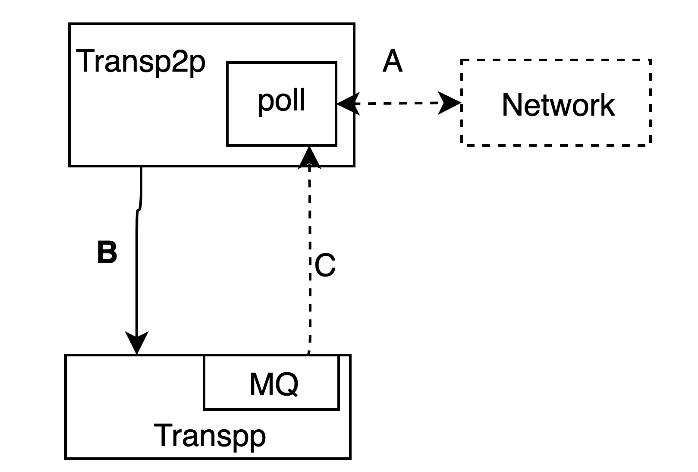

## 邻节点推送算法
### 推/拉算法说明
考虑节点A、B和C，A向B和C发送某个数据块，经过一段时间的延时后，B转发此数据区给C，但此时C已经收到过A发送的数据了，因此这个数据再发送一次是没有意义的。

我们使用如下的方案，当A需要向B发送数据时，A首先向B发送到一个数据传输请求，这个请求里包含了待发送数据块的哈希值，B收到这个请求后，本地检测哈希对应的数据块是否存在，只有当这个数据块不存在时，才会向A请求此数据，因此包含四个步骤：
1.  A 向 B发送 {pushhash,hash}
2.  B 向 A请求 {pullhash,hash}
3.  A 向 B发送 {pushdata,hash,data}
4.  B 验证 Hash(data) == hash

通过这个方式，使数据不会重复传输

# Transp2p设计描述
## 接口描述
Transp2p通过实现与邻节点之间的数据交互，Transpp模块向上与Transp2p连接，向下与网络数据发送模块连接，如下图：  

我们根据图上的A/B/C/D四个接口分别讨论。

A是Transpp向Transp2p提交消息的接口,包括：
* 数据到达：Transpp接收到一个数据，需要提交给Transpp处理
   
B是Transp2p向Transpp发送的请求，可以是函数调用，因此使用实线箭头表示，包括：
* 请求数据中继

C是网络层向Transpp发送的消息，包括：
* RelayData请求中继数据
* PullData请求获取哈希对应的数据
* PushData推送哈希对应的数据

D是Transpp模块向网络层发送数据的请求，同样可以是函数调用（假如网络层支持），因此使用实线箭头表示，同样包括：
* RelayData请求中继数据
* PullData请求获取哈希对应的数据
* PushData推送哈希对应的数据

此处我们可以推断，Transpp使用使用网络模块进行数据的发送和接收，路由部分同样需要使用网络模块，为了网络模块被多个客户端模块调用产生问题，我们改造结构如下：  

在Transpp中添加一个消息队列，这里面的核心是Transp2p的poll函数，poll函数从transpp/network的消息队列中中获取事件数据进行分分析事件，属于需network处理的分配给network,需要transpp处理的分配给transpp。
## 实现过程说明
在P2P网络中，一个节点具有多个邻节点，因此有可能会多个邻节点收到同一数据，这样对网络带宽造成极大的浪费。为了解决这个问题，transpp使用push/pull的方式进行数据传输。push/pull传输定义如下：
1. 如果数据小（小于等于256字节），直接发送
2. 如果数据大于256字节，首先发送哈希值
3. 对方收到此数据后，检查本地是否有哈希值对应的数据，如果没有，向来源节点发送pulldata请求
4. 源节点收到pulldata请求后，向请求者发送pushdata，把哈希及对应的数据推送给请求者
数据收取成功后，再通知上层应用有数据到达。
### 特殊情况考虑：
1. 节点在收到A推送的数据后，又收到B推送的同样数据，这时候节点还在向A请求数据的过程中，不应该立刻向B请求数据，这个需要处理。
2. 上述的情况下，如果从A请求数据失败了（比如A正好断线了），应该再向B请求数据。
3. 两次同样的数据到达，应该只向上层服务汇报一次
### 优化数据复制工作
PushData的数据有可能会比较大，如果不作任何处理，数据从Transp2p传输到Transpp，需要做数据复制，Transpp再通知给Transp2p，又需要做一次复制，然后由Poll通知Network传输，又需要一次复制。这些数据复制工作极大降低了系统的效率。
为了解决这个问题，我们可以用两种方式：
### 方案1：
我们在Transp2p中建立数据缓存，然后把数据缓存的句柄提交给Transpp，数据缓存的工作在Transp2p中执行，Transpp可以查询哈希对应的数据是否存在，从而决定行为操作。  
在这种方案下，pulldata从transp2p模块被转发到transpp模块，transpp读取位于Transp2p模块中的data_cache，然后再回应消息给Transp2p。这个流程感觉是完全多余的，不是非常合理

### 方案2：
把Transpp的功能合并到Transp2p里，这样所有多余的流程全部可以取消了。但是这样会使Transp2p功能更多，没有保持精简。  
最终方案使用方案2，然后使用rust的trait模式来使Transp2p的实现可以分功能模块实现，以保持简洁性。

# 数据发送过程的路由问题
当数据无法找到目标节点的路由时，有两种方案，一种是自动发现路由，一种是直接丢弃。 实现中，兼有这两种方式：在传输数据包中有自动发现的标志位，如果该标志位是1，则在没有到目标节点的时候，自动发现。
