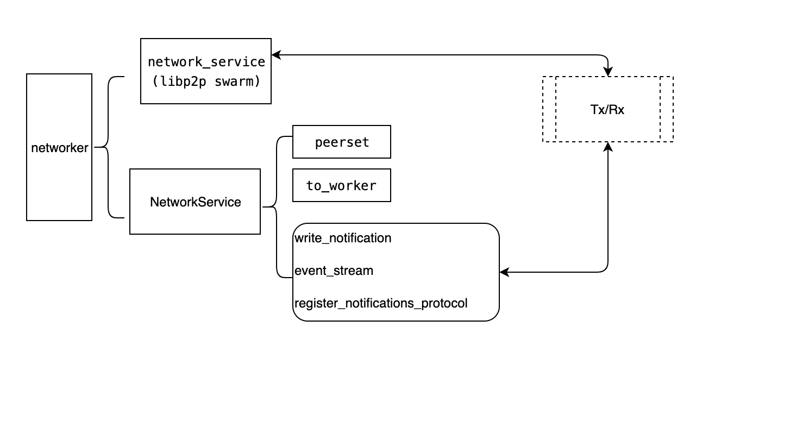

# 消息化调用
为了防止服务提供的函数在多个线程中被调用产生的同步问题，系统采用消息机制实现，网络结构如下：

在创建实际应用时，通过NetworkWorker::new()创建一个实例networker，这个类将创建NetworkService和network_service(一个libp2p swarm)对象。**名字为什么这么绕口和相似？substrate干的！**。NetworkerService实例可以通过.service()函数返回出去。  
客户端使用返回得到的NetworkService实例提供的接口对network_service进行操作，而这个network_service就是NetworkBehaviour对象，也就是Transp2p/DelaySend/GroupSet实例。  
由上图可知，在操作时，通过Tx/Rx进行解耦，这样所以的network_service操作调用都将在poll时解析命令然后在poll中来调用相应函数实现。这样就不需要考虑这些函数的可重入性。对结构内的数据进行操作时，也无需使用同步。  
当然，这种方案带来了一个麻烦，就是所有的函数接口必须NetworkService中定义成事件进行收发。另外会不会因为单线程导致堵塞。考虑到network_service(NetworkBehaviour)的服务特性（只是提供服务接口），使用这种方案是值得的。
我们在以下的设计中，首先分开设计各个服务模块的对外接口及内部过程。最后统一设计消息化的事件。

# Transp2p
Transp2p有三个部分组成,routetab--路由表，swarmkad--具有饱和度计算的KAD表，以及transpp本身。
Transpp实现了NetworkBehaviour，并且通过Legency模式的CustomMsg实现节点间的通信。
Transpp通过push/pull的方式进行数据传输，即发送大数据时，即点首先推送数据的哈希，对端收到哈希时，检查是否有该哈希对应的数据，如果没有则请求相应的数据，否则就直接使用本地已经存在的数据。

详细的传输设计方案见[传输框架详细设计](./传输框架详细设计.md)
# GroupSet
GroupSet实现分组管理功能
## 数据结构说明
### 已经加入的组
### 正在监控的组
# DelaySend
## 数据结构说明：
### 待发送的数据项
```rust
struct PendDataItem {
    weight:u64,
    data:Vec<u8>,
    timeout:futures_timer::Delay,
}
```
在这个数据项中，
* weight是权重
* data是编码后的待发送的数据
* timeout:是要发送/或是取消的时间

### 待发送队列 pending_data_queue;
在类结构中有一个以data_id为键值的待发送数据映射表，当有数据插入时，根据data_id匹配数据是否重复，这个数据发送映射表中有一个超时时间。
```rust

pending_data_queue:HashMap<BlockT::Hash,PendData>
```
data_id是由应用层决定的数据标识，它是一个哈希值，在DelaySend模块中，data_id一样的数据被认为是可互相覆盖的（一般来说是高山权重的覆盖低权重的），如何生成data_id是应用层管理的，在Pynx中，使用的是 Hash(（数据类型）2字节+（分片ID）2字节 + （区块高度）8字节)来表征唯一的ID值
### 已经发送队列 sent_data_cache
在运行过程，可能会遇到这样一种情况，同一个data_id的数据，当高权重的数据被发送完毕后，又收到了低权重的数据，这时候，pending_data_queue中的数据已经被移除，因此模块无法知晓这个数据已经被处理过，有可能会再转发一次该低权重的数据。为了解决这个问题，我们增加一个sent_data_cache的数据：
```rust
    sent_data_cache:LruCache<Hash,weight>
```
这是一个LRU（最长时间不用）的缓存，当数据被发送后，移动到此对象中。当有新的数据到达时，通过此对象检查是否有更高权重的数据被发送过，如果有，就拒绝/忽略新来的数据。
考虑另外一种情况：低权重的数据被发送后，信息移动到了sent_data_cache队列中；然后又来了一个高权重的数据，经过比较需要发送，因此会在pending_data_queue又添加一项，然而这时候sent_data_cache对象中的数据还没有过期。在这种情况下，sent_data_cache/pending_data_queue中可能会存在同一个data_id。为了解决这个问题，代码需要在pending_data_queue中加入数据时，从sent_data_cache中删除对应的项。
## 过程说明
### delay_send_groups
#### 说明
这个是提供给客户端的调用函数，当客户端有数据要进行延时组播发送时，调用此函数
#### 过程
1. 检查data_id是否在sent_data_cache中存在，
   1. 如果存在，比较weight，如果新数据的weight小于原有的，返回并且告诉调用者这个操作被忽略
2. 检查pending_data_queue中是否存在该data_id,
   1. 如果存在，比较weigt,如果weight小于原有的，返回并且告诉调用者这个操作被忽略
3. 生成一个新的PendDataItem，添加到pending_data_queue中
4. 从sent_data_cache中删除对应的data_id项

### do_send_groups
这个是内部定时器到达时，进行的操作：
1. 调用GroupSet进行数据发送
2. 从pending_data_queue中移除
3. 在sent_data_cache中添加<data_id,weight>
### poll
poll是future调用的，需要做以下的工作：
1. 遍历pending_data_queue所有的项，
2. 如果项里的timeout到达，就对该项执行do_send_groups
## SeedGroup有源组
